# Proyek Sistem Rekomendasi: Rekomendasi Film - Fayyaza Faryal Anakidanda

## Overview Proyek

Di era digital, jumlah konten hiburan yang tersedia secara daring meningkat secara signifikan. Platform streaming seperti Netflix, Disney+, dan Amazon Prime menawarkan ribuan judul film dan serial yang dapat diakses kapan saja. Namun, melimpahnya pilihan ini justru menimbulkan tantangan bagi pengguna dalam menemukan tontonan yang sesuai dengan preferensi mereka.

Penelitian menunjukkan bahwa sistem rekomendasi memainkan peran penting dalam membantu pengguna menyaring informasi dan meningkatkan kepuasan dalam mengakses layanan digital (Zhang et al., 2017). Dengan memberikan rekomendasi yang relevan dan dipersonalisasi, sistem ini dapat mempercepat pengambilan keputusan, meningkatkan retensi pengguna, serta memperpanjang durasi keterlibatan mereka di dalam platform.

Penerapan sistem rekomendasi film tidak hanya meningkatkan kenyamanan dalam menelusuri konten, tetapi juga memberikan dampak positif terhadap keterlibatan pengguna dan konsumsi konten. Selain itu, sistem ini juga dapat memperkenalkan penonton pada genre atau film yang sebelumnya tidak mereka ketahui, namun sesuai dengan selera mereka, sehingga mendorong pengalaman menonton yang lebih kaya dan personal.

**Proyek ini penting untuk diselesaikan karena:**
* Membantu pengguna menemukan film yang sesuai minat dengan lebih efisien

* Menunjukkan penerapan sistem rekomendasi dalam dunia nyata, khususnya industri hiburan digital

* Meningkatkan akurasi rekomendasi agar pengalaman pengguna terasa lebih personal dan relevan

Sistem rekomendasi akan dibangun menggunakan dua pendekatan utama: Content-Based Filtering, yang merekomendasikan film berdasarkan kemiripan konten seperti genre, sinopsis, dan kata kunci; serta Collaborative Filtering, yang memanfaatkan data rating pengguna untuk menemukan pola preferensi serupa. Proyek ini menggunakan dataset publik berjudul "The Movies Dataset" yang tersedia di Kaggle.

Referensi:
Zhang, S., Yao, L., Sun, A., & Tay, Y. (2017). Deep Learning Based Recommender System: A Survey and New Perspectives. https://www.researchgate.net/publication/318671349

Herlocker, J. L., Konstan, J. A., Terveen, L. G., & Riedl, J. T. (2004). Evaluating Recommendation Systems. ResearchGate https://www.researchgate.net/publication/226264572

## Business Understanding

### Problem Statements
1. Banyaknya pilihan film yang tersedia secara daring membuat pengguna, terutama yang baru bergabung, kesulitan menemukan tontonan yang sesuai dengan selera mereka. Hal ini dapat mengurangi kenyamanan menonton dan menyebabkan pengguna cepat meninggalkan platform.
2. Sebagian besar platform masih menggunakan pendekatan rekomendasi yang sederhana, seperti menampilkan daftar film populer, tanpa mempertimbangkan preferensi individual. Akibatnya, rekomendasi terasa generik dan kurang relevan secara personal.
3. Pengguna sering memberikan rating atau ulasan setelah menonton sebagai bentuk umpan balik. Namun, data ini belum dimanfaatkan secara optimal untuk membentuk rekomendasi yang lebih akurat dan personal.

### Goals

1. Mengembangkan sistem rekomendasi film yang dapat membantu pengguna baru menemukan film yang relevan, meskipun belum memiliki riwayat tontonan (mengatasi masalah cold-start).
2. Memberikan rekomendasi yang personal dan relevan, sehingga meningkatkan kenyamanan, kepuasan, serta keterlibatan pengguna di dalam platform.
3. Menggabungkan data metadata film dan data interaksi pengguna untuk menghasilkan sistem rekomendasi yang lebih cerdas dan adaptif terhadap pola preferensi.

### Solution Statement
Untuk mencapai tujuan tersebut, proyek ini menerapkan dua pendekatan sistem rekomendasi:
1. Content-Based Filtering
  * Menganalisis karakteristik konten film seperti genre, sinopsis, dan kata kunci. Sistem akan merekomendasikan film yang memiliki kemiripan dengan film yang disukai pengguna. Pendekatan ini sangat cocok untuk pengguna baru.
2. Collaborative Filtering
  * Menggunakan data rating dari pengguna untuk menemukan pola kesamaan antar pengguna. Sistem kemudian merekomendasikan film yang disukai oleh pengguna lain dengan preferensi serupa.

Kedua pendekatan ini saling melengkapi dan diharapkan dapat memberikan rekomendasi yang lebih personal, fleksibel, dan efektif untuk berbagai tipe pengguna.

## Data Understanding
### Dataset

Dalam proyek ini, digunakan dataset berjudul ["The Movies Dataset"](https://www.kaggle.com/datasets/rounakbanik/the-movies-dataset) dari Kaggle, yang berisi metadata film serta interaksi pengguna dalam bentuk rating. Dataset ini dirancang untuk menganalisis preferensi pengguna terhadap film dan membangun sistem rekomendasi yang dapat menyarankan film secara personal. Tujuan dari dataset ini adalah untuk membantu pengguna menemukan film yang relevan dengan minat mereka berdasarkan konten film dan interaksi pengguna lainnya.<be>

**Variabel dalam Dataset**

1. **movies_metadata.csv** digunakan sebagai sumber utama untuk pendekatan content-based filtering.
Dengan total jumlah entri: 28.070 data, file ini berisi metadata lengkap dari film. Berikut adalah seluruh fitur dalam file ini:

    * adult: Menunjukkan apakah film mengandung konten dewasa (boolean)
    * belongs_to_collection: Informasi koleksi film (jika merupakan bagian dari serial/waralaba)
    * budget: Anggaran produksi film
    * genres: Daftar genre film (dalam format string JSON)
    * homepage: URL halaman resmi film
    * id: ID unik film
    * imdb_id: ID film di IMDb
    * original_language: Bahasa asli film
    * original_title: Judul asli film
    * overview: Ringkasan cerita (sinopsis)
    * popularity: Skor popularitas berdasarkan TMDB
    * poster_path: Path poster film dari TMDB
    * production_companies: Daftar perusahaan produksi (format JSON)
    * production_countries: Negara produksi (format JSON)
    * release_date: Tanggal rilis film
    * revenue: Pendapatan kotor film
    * runtime: Durasi film (dalam menit)
    * spoken_languages: Bahasa yang digunakan dalam film (format JSON)
    * status: Status rilis film (seperti “Released”, “Post Production”, dll.)
    * tagline: Kalimat slogan/promosi film
    * title: Judul film
    * video: Menunjukkan apakah film adalah video promosi (boolean)
    * vote_average: Rata-rata rating pengguna
    * vote_count: Jumlah pengguna yang memberikan rating

2. **ratings_small.csv** digunakan untuk membangun model collaborative filtering. Dengan total jumlah entri: 10.0004 data, file ini mencatat interaksi pengguna berupa rating terhadap film. Fitur yang tersedia:
    * userId: ID unik pengguna
    * movieId: ID film berdasarkan MovieLens
    * rating: Nilai rating dari pengguna (skala 0.5–5.0)
    * timestamp: Waktu pemberian rating (format Unix timestamp)

3. **keywords.csv** digunakan untuk memperkuat fitur konten film dalam pendekatan content-based filtering.
Dengan total jumlah entri: 46.419 data, file ini menyajikan kata kunci tematik yang berkaitan dengan film. Fitur yang tersedia:
    * id: ID film (mengacu ke movies_metadata.csv)
    * keywords: Daftar kata kunci (format list dalam string JSON)

### Tahapan Awal Ekplorasi Data
Beberapa tahapan eksplorasi dan pemahaman data yang dilakukan:
* **Load Dataset**: Memuat seluruh dataset yang digunakan (movies_metadata, ratings_small, keywords)
* **Melihat Struktur Dataset**: Menampilkan ukuran dataset, tipe data, dan 5 baris teratas dari masing-masing file
* **Deskripsi Data Numerik**: Mendapatkan ringkasan statistik fitur numerik seperti vote_average, popularity, dan runtime
* **Cek Missing Values dan Duplikat**: Memastikan apakah terdapat data yang hilang atau baris yang duplikat

  **Insight Missing Values:**
    * 24,898 data null di kolom belongs_to_collection
    * 23,530 data null di kolom homepage
    * 12,920 data null di kolom tagline
    * 277 data null di kolom overview
    * 149 data null di kolom poster_path
    * 62 data null di kolom runtime
    * 31 data null di kolom release_date
    * 39 data null di kolom status
    * 12 data null di kolom imdb_id
    * 3 data null di kolom original_language, revenue, spoken_languages, title, video, vote_average, vote_count
    * 2 data null di kolom popularity, production_companies, production_countries

    Tidak ditemukan nilai null pada dataset ratings_small.csv maupun keywords.csv.

  **Insight Duplicate:**
  * Terdapat 10 baris duplikat di dataset movies_metadata.csv
  * Tidak ditemukan baris duplikat di dataset ratings_small.csv
  * Ditemukan 987 baris duplikat di dataset keywords.csv, yang perlu dibersihkan untuk menghindari pengulangan informasi konten pada film
  * Univariate Exploratory Data Analysis: Mengeksplorasi variabel seperti genre, jumlah rating per film, dan distribusi popularitas film

* **Univariate Exploratory Data Analysis**: Mengeksplorasi variabel seperti genre, jumlah rating per film, dan distribusi popularitas film
  1. Visualisasi Distribusi Rating Pengguna 
  Bertujuan untuk melihat seberapa sering nilai rating tertentu diberikan oleh pengguna. Ini membantu memahami pola penilaian — apakah pengguna cenderung memberi rating tinggi, rendah, atau rata-rata. 
  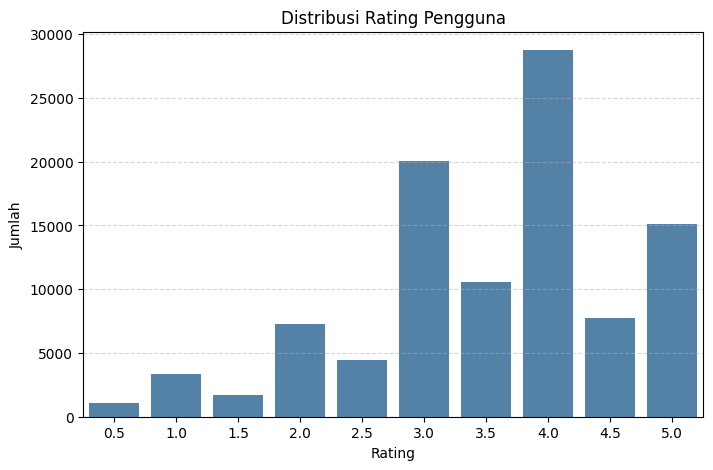 
  2. Visualisasi Distribusi Genre Film 
  Bertujuan untuk mengetahui genre apa saja yang paling sering muncul dalam dataset movies_metadata.csv. Ini membantu memahami preferensi umum dan potensi fitur dalam content-based filtering.  
  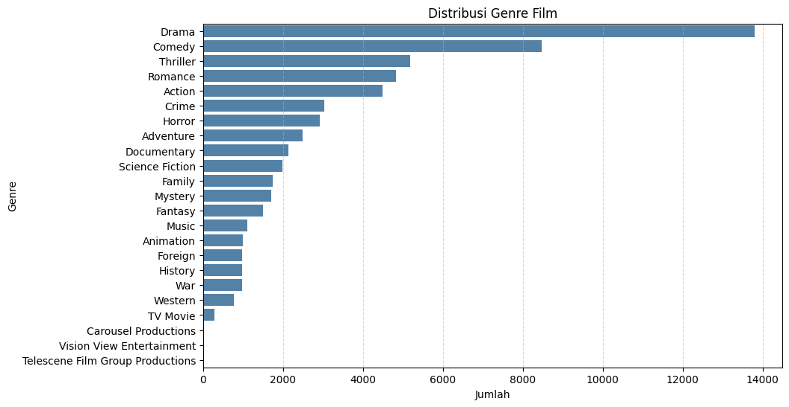 
  3. Visualisasi Film dengan Jumlah Rating Terbanyak 
 Bertujuan untuk mengetahui film mana yang paling sering diberi rating oleh pengguna, sebagai indikator popularitas dan minat. 
 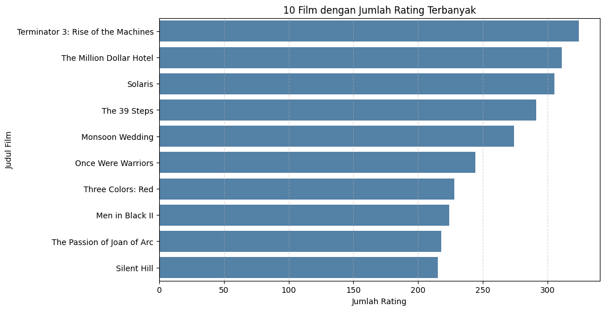 
  4. Visualisasi Distribusi Durasi Film 
  Bertujuan untuk melihat sebaran durasi film, mengidentifikasi film berdurasi pendek atau panjang ekstrem (outlier), dan menentukan apakah perlu membersihkan data berdasarkan runtime. 
  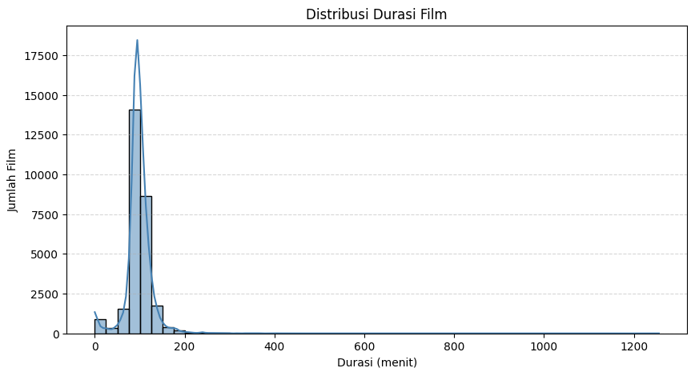 

### Visualisasi yang Dilakukan
* Boxplot: Digunakan untuk mendeteksi outlier pada kolom numerik seperti popularity, vote_average, dan runtime
* Bar Plot: Digunakan untuk melihat distribusi kategori seperti genre film, serta daftar film dengan jumlah rating terbanyak
* Histogram: Digunakan untuk melihat distribusi rating pengguna dan durasi film

## Data Preparation

Ditahap ini, dilakukan beberapa proses cleaning dan transforming data
* **Menghapus Data yang Null:** 
  Membersihkan nilai kosong pada kolom penting seperti title, overview, genres, dan runtime untuk mencegah error saat pemodelan dan menjaga kualitas data. 
  Beberapa kolom penting pada dataset movies_metadata.csv mengandung nilai kosong (null) yang dapat mengganggu proses pemodelan. 

  **Insight:** Data dihapus karena memiliki nilai kosong pada kolom penting seperti title, overview, genres, dan runtime. Kolom-kolom ini digunakan secara langsung dalam proses pemodelan content-based filtering, sehingga wajib lengkap agar sistem dapat memberikan rekomendasi yang akurat. Sementara itu, nilai null pada kolom lain seperti homepage, tagline, belongs_to_collection, dan release_date tidak dibersihkan karena kolom-kolom tersebut tidak digunakan sebagai fitur utama dalam sistem rekomendasi. Menghapus baris berdasarkan kolom yang tidak relevan justru berisiko mengurangi jumlah data secara signifikan tanpa memberikan dampak terhadap kualitas model.

* **Membersihkan Kolom genres dan keywords:** 
  Mengubah format string JSON pada kolom genres dan keywords menjadi list of strings agar dapat digunakan dalam content-based filtering.  

  Kolom genres pada dataset movies_metadata.csv dan kolom keywords pada dataset keywords.csv awalnya tersimpan dalam format string JSON. Data ini telah berhasil dikonversi menjadi list of strings yang lebih mudah digunakan dalam analisis berbasis konten. Pembersihan ini diperlukan agar model dapat memproses informasi genre dan kata kunci secara akurat. 

* **Menghapus Outlier pada Kolom runtime:** 
 Menghapus durasi film yang terlalu pendek (< 30 menit) atau terlalu panjang (> 300 menit) yang tidak realistis. 

  **Insight:** Film dihapus karena memiliki durasi di luar rentang 30–300 menit. Pembersihan ini bertujuan untuk menghindari pengaruh nilai ekstrem yang dapat merusak akurasi model, dan memastikan fitur runtime mencerminkan film berdurasi wajar.

* **Merge Dataset:** 
 Menggabungkan movies_metadata.csv dan keywords.csv untuk memperkaya fitur konten. Hapus juga kolom yang tidak digunakan agar data lebih bersih dan fokus.
 Menggabungkan informasi dari dua sumber:
    * movies_clean: berisi metadata film seperti title, overview, genres, dan runtime

    * keywords: berisi daftar kata kunci tematik untuk setiap film  
  Penggabungan dilakukan berdasarkan kolom id agar setiap film memiliki representasi konten yang lebih kaya. 
   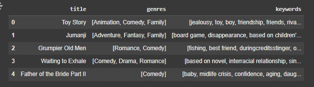  
   **Insight:** Dataset movies_merged menyatukan metadata film dan kata kunci, sehingga setiap film kini memiliki fitur konten yang lebih lengkap. Kolom genres dan keywords akan digunakan bersama dengan overview untuk membentuk fitur gabungan dalam model content-based filtering.

* **Content-Based Filtering Preparation:** 
  Tahap ini bertujuan untuk menyiapkan data yang akan digunakan dalam model Content-Based Filtering, di mana rekomendasi film diberikan berdasarkan kemiripan konten antar film seperti genre, sinopsis, dan kata kunci.

  Pendekatan ini tidak memerlukan data interaksi pengguna, tetapi bergantung pada deskripsi dan metadata film. Untuk itu, dilakukan penggabungan berbagai fitur konten menjadi satu representasi teks yang dapat dianalisis secara numerik menggunakan teknik vektorisasi teks.
   
  Berikut adalah tahapannya:

  1. Pertama,  gabungkan isi kolom genres, keywords, dan overview menjadi satu string agar dapat diproses oleh algoritma teks (TF-IDF + cosine similarity).

  2. Setelah kolom `combined_features` berhasil dibuat, langkah berikutnya adalah mentransformasikan teks tersebut ke dalam bentuk vektor numerik agar dapat digunakan dalam perhitungan kemiripan antar film. Teknik yang digunakan untuk representasi teks ini adalah **TF-IDF (Term Frequency-Inverse Document Frequency)**.

  TF-IDF menghitung bobot pentingnya kata dalam sebuah dokumen (dalam hal ini film), relatif terhadap semua film lainnya di dataset. Semakin unik sebuah kata dalam sebuah film, semakin tinggi bobotnya. Hal ini memungkinkan model mengenali kata kunci khas dari setiap film.

  Proses ini dilakukan menggunakan `TfidfVectorizer` dari library `sklearn`, dengan batas maksimum 3000 fitur dan penghapusan stopwords untuk menjaga efisiensi memori dan fokus pada kata-kata penting. 
  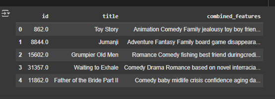  

 **Insight:**
  Dataset content_based_df berhasil dibentuk sebagai struktur minimal dan efisien yang hanya berisi informasi yang dibutuhkan untuk model content-based filtering. Kolom combined_features yang telah dibuat menggabungkan genre, kata kunci, dan ringkasan cerita, sehingga bisa digunakan untuk mengukur kemiripan antar film secara tekstual. Struktur ini memudahkan saat proses vektorisasi dan perhitungan cosine similarity nantinya.

  3. Sampling Data  
  Dilakukan pemilihan secara acak terhadap 5.000 data film dari content_based_df dengan random_state=42 agar hasil sampling dapat direproduksi. Hal ini dilakukan agar sistem tetap dapat berjalan optimal di perangkat dengan memori terbatas, tanpa memproses seluruh 42.000+ data film.

  **Kenapa hanya 5000 data?** Untuk menghindari kendala teknis terkait keterbatasan memori (RAM) pada perangkat lokal, proses content-based filtering dalam proyek ini dijalankan menggunakan subset data berjumlah 5.000 film yang diambil secara acak dari keseluruhan dataset. Pendekatan ini tetap mewakili struktur data dan logika sistem rekomendasi secara menyeluruh, serta tidak memengaruhi kualitas implementasi. Jika dijalankan pada perangkat dengan spesifikasi lebih tinggi, sistem dapat diperluas untuk mencakup seluruh dataset

  4. TF-IDF Vectorization  
   Langkah ini mengubah teks gabungan (genre + keywords + sinopsis) menjadi representasi numerik menggunakan TF-IDF. Jumlah maksimal kata penting dibatasi 3.000 untuk menjaga efisiensi memori. TF-IDF menekankan kata-kata unik dalam tiap film dibandingkan seluruh koleksi film.

* **Collaborative Filtering Preparation:** 
  Dalam model Collaborative Filtering berbasis deep learning, sistem tidak dapat langsung memahami data dalam format string seperti userId dan movieId. Oleh karena itu, dilakukan proses encoding untuk mengubah ID pengguna dan ID film menjadi representasi numerik menggunakan teknik enumerate(), yang menghasilkan mapping dari ID asli ke indeks numerik yang dapat diproses oleh model. 

  Selain itu, dilakukan juga normalisasi nilai rating agar semua nilai berada dalam skala 0–1. Normalisasi ini bertujuan untuk membantu proses pelatihan model menjadi lebih stabil dan efisien.. 
  Berikut adalah tahapannya:

  1. Ambil dan salin data yang dibutuhkan, data rating dari pengguna digabungkan dengan judul film agar lebih informatif, lalu disederhanakan hanya ke kolom userId, movieId, title, dan rating untuk memudahkan pemrosesan lebih lanjut.

  2. Encoding dilakukan pada userId dan movieId karena model deep learning tidak dapat memahami data dalam bentuk string. Oleh karena itu, ID pengguna dan ID film diubah menjadi representasi numerik menggunakan teknik enumerate(), yang menghasilkan dictionary sebagai mapping dari ID asli ke bentuk indeks numerik yang dapat diproses oleh model.
  
  3. Mapping ke kolom baru, kolom baru user dan movie disiapkan untuk digunakan oleh model. Nilai rating dikonversi ke float32 agar kompatibel dengan model TensorFlow.

  4. Menampilkan jumlah total pengguna dan film unik yang akan digunakan oleh model, serta memeriksa skala rating awal (antara 0.5–5.0). Informasi ini penting sebelum dilakukan normalisasi ke skala 0–1. 
    

  5. Nilai rating dinormalisasi agar berada dalam rentang 0–1 menggunakan min-max normalization, sehingga model tidak bias terhadap skala asli rating. Setelah itu, data dibagi menjadi dua subset: 80% untuk data pelatihan dan 20% untuk data validasi. Pembagian ini dilakukan untuk mengukur performa model pada data yang belum pernah dilihat saat pelatihan. 
  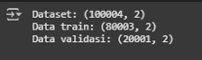  

  **Insight:** Dataset collaborative filtering berhasil disiapkan dengan mengubah userId dan movieId menjadi representasi numerik. Data kemudian dibagi menjadi 80% untuk pelatihan dan 20% untuk validasi, sehingga siap digunakan dalam model rekomendasi berbasis interaksi pengguna.

## Modeling and Results

### 1. Content-Based Filtering
  Content-Based Filtering adalah pendekatan dalam sistem rekomendasi yang bekerja dengan menganalisis karakteristik konten dari item (dalam hal ini film), seperti genre, kata kunci, dan sinopsis. Sistem kemudian merekomendasikan film lain yang memiliki kemiripan konten dengan film yang pernah disukai atau dipilih oleh pengguna.

  Pendekatan ini tidak membutuhkan data dari pengguna lain, sehingga sangat cocok digunakan untuk pengguna baru yang belum memiliki riwayat interaksi atau rating. 

  **Cara Kerja Singkat:** 
  Sistem ini mengubah informasi konten film menjadi representasi numerik dan menghitung kemiripan antar film menggunakan metode pengukuran jarak (misalnya cosine similarity). Film yang paling mirip dengan film yang disukai pengguna akan direkomendasikan.

**Kelebihan:**
* Dapat menangani cold-start pada pengguna baru karena tidak memerlukan data interaksi pengguna lain.
* Rekomendasi yang diberikan lebih personal dan sesuai dengan konten yang relevan.
* Tidak bergantung pada popularitas film, sehingga bisa memberikan saran unik.
   
**Kelemahan:**
* Kurang eksploratif karena hanya menyarankan film yang mirip secara konten.
* Bergantung pada kelengkapan dan kualitas metadata (sinopsis, genre, keywords, dll).
* Sulit menangani kasus di mana pengguna ingin rekomendasi dari genre yang benar-benar berbeda dari preferensinya sebelumnya.
   

Berikut adalah tahapannya:
  1. Menghitung Kemiripan Antar Film (Cosine Similarity) 

  Setelah fitur konten diubah menjadi representasi vektor, tahap utama dalam Content-Based Filtering adalah menghitung kemiripan antar film. Untuk itu, digunakan metode cosine similarity, yang mengukur kedekatan arah antara dua vektor teks.

  2. Membentuk Matriks Kemiripan Antar Film  

  Matriks cosine similarity dikonversi menjadi DataFrame agar memudahkan pencarian dan pemetaan kemiripan antar judul film. Baris dan kolom berisi nama film, dan setiap sel berisi nilai kemiripan (dalam rentang 0–1).

  3. Fungsi Rekomendasi Film  
  Fungsi ini menerima input berupa judul film dan mengembalikan Top-10 film yang paling mirip berdasarkan skor cosine similarity. Fungsi ini menghindari merekomendasikan film yang sama dengan input dan dapat diintegrasikan dengan antarmuka pengguna secara langsung.

**Contoh Penggunaan Fungsi Rekomendasi**  contoh penggunaan fungsi movie_recommendations dengan judul "Toys in the Attic" untuk menampilkan 10 film lain yang paling mirip secara konten. Hasil rekomendasi biasanya memiliki tema fantasi, anak-anak, atau petualangan — sesuai dengan konten film acuan.

**Hasil Rekomendasi Top-10:** 

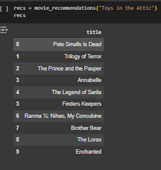  
  **Insight:** Model berhasil merekomendasikan film yang memiliki kesamaan tema fantasi, animasi, dan petualangan dengan film "Toys in the Attic". Beberapa judul seperti "The Lorax", "Brother Bear", dan "The Legend of Sarila" juga menampilkan nuansa imajinatif dan ramah anak, menunjukkan bahwa sistem content-based filtering dapat mengenali pola konten serupa dari genre dan narasi film. Ini menunjukkan bahwa sistem dapat mengenali pola konten dengan baik dan memberikan saran yang relevan berdasarkan kemiripan semantik.

## 2. Collaborative Filtering

Collaborative Filtering adalah pendekatan yang merekomendasikan item (dalam hal ini film) berdasarkan interaksi pengguna seperti rating. Model akan belajar dari pola kesukaan banyak pengguna, lalu menyarankan film kepada pengguna lain yang memiliki preferensi serupa.

**Kelebihan:**
* Tidak membutuhkan informasi konten film
* Bisa mengungkap pola hubungan tersembunyi antar film
* Cocok untuk dataset dengan banyak data interaksi pengguna

**Kelemahan:**
* Tidak cocok untuk pengguna/item baru (cold-start)
* Membutuhkan data interaksi yang cukup banyak untuk bekerja optimal

**Arsitektur Model (RecommenderNet)** 

Menggunakan model deep learning berbasis embedding, dengan komponen:
* user_embedding dan movie_embedding: mengubah ID user dan movie jadi vektor
* user_bias dan movie_bias: membantu model lebih fleksibel
* dot_user_movie: mengukur kedekatan user dan movie
* sigmoid: mengubah skor jadi nilai antara 0–1

Berikut adalah tahapannya:
  1. Mendefinisikan model rekomendasi berbasis TensorFlow bernama RecommenderNet. Model ini menggunakan teknik embedding untuk memetakan ID pengguna dan ID film ke dalam representasi vektor berdimensi rendah. Setiap pengguna dan film juga diberikan bias masing-masing. Produk dot antara embedding pengguna dan film dihitung, lalu ditambahkan dengan bias sebelum diterapkan fungsi aktivasi sigmoid. Dropout ditambahkan untuk regularisasi dan mencegah overfitting.

  2. Kompilasi dan Training Model

  Model dikompilasi menggunakan fungsi loss Mean Squared Error (MSE) yang umum dipakai untuk regresi seperti prediksi rating. Optimizer RMSprop digunakan dengan learning rate 0.001. Selain itu, metrik evaluasi yang dipantau adalah Root Mean Squared Error (RMSE). Model kemudian dilatih selama 10 epoch dengan data training (x_train, y_train) dan divalidasi menggunakan data validasi (x_val, y_val). Pelatihan ini memungkinkan model belajar hubungan antara pengguna dan film berdasarkan pola interaksi yang ada.

    **Hasil Training:** 

    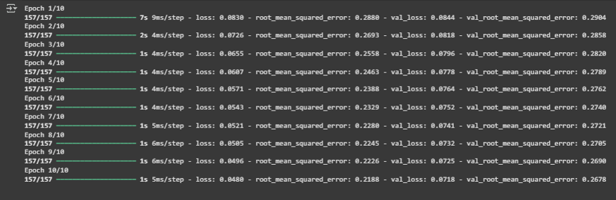  
    
    **Insight:**

    * Model berhasil menurunkan error prediksi (RMSE) dari epoch 1 hingga 10.

    * RMSE akhir data validasi sebesar 0.2678 menandakan prediksi model cukup akurat untuk skala 0–1.

    * Model menunjukkan stabilitas yang baik tanpa lonjakan error → menandakan bahwa model tidak overfitting.

    * Model siap digunakan untuk memberikan rekomendasi film kepada pengguna berdasarkan pola rating mereka.

  3. Setelah model collaborative filtering selesai dilatih, langkah selanjutnya adalah menghasilkan rekomendasi film berdasarkan pola kesukaan pengguna. Proses dimulai dengan memilih satu userId secara acak dari dataset rating. Kemudian, diambil daftar film yang sudah pernah dirating oleh pengguna tersebut. Dari situ, disusun daftar film yang belum dirating—yaitu film yang belum ditonton oleh pengguna dan tersedia dalam data (termasuk dalam pemetaan movie_to_movie_encoded). Film-film inilah yang akan digunakan untuk prediksi dan rekomendasi.

  4. Pilih Satu User dan Siapkan Data Film yang Belum Dirating, Encode User dan Movie, Buat Array Prediksi dan Buat Fungsi Rekomendasi Film. Film yang belum ditonton oleh user diencode menggunakan movie_to_movie_encoded, lalu digabung dengan ID user yang telah diencode untuk membentuk pasangan [user, movie]. Hasilnya adalah array input yang siap digunakan oleh model untuk memprediksi rating terhadap setiap film.   Fungsi ini memprediksi rating terhadap film yang belum ditonton user, lalu mengambil top-k film dengan skor tertinggi sebagai rekomendasi. ID film hasil prediksi dikonversi kembali ke ID asli, kemudian dicocokkan dengan metadata dari dataset movies untuk menampilkan judulnya. Rekomendasi ditampilkan dalam format daftar terurut, dan juga dikembalikan sebagai DataFrame.

  **Hasil Rekomendasi:** 

  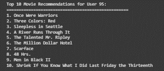  
    **Insight:**

    Rekomendasi yang dihasilkan untuk user ID 95 menunjukkan variasi film dari berbagai genre, mulai dari drama, crime, hingga action. Hal ini menunjukkan bahwa model collaborative filtering mampu menangkap preferensi tersembunyi pengguna berdasarkan pola interaksi pengguna lain yang memiliki kesamaan selera.

    Beberapa film seperti “Once Were Warriors” dan “Three Colors: Red” menunjukkan bahwa pengguna ini cenderung menyukai film dengan tema emosional dan mendalam, sementara film seperti “Men in Black II” dan “48 Hrs.” mengindikasikan adanya preferensi terhadap film aksi dan komedi.

    Secara keseluruhan, model berhasil memberikan rekomendasi yang beragam namun masih relevan, yang merupakan kekuatan utama dari pendekatan collaborative filtering.

## Evaluation

### 1. Content-Based Filtering

Evaluasi dilakukan dengan menggunakan Precision, yaitu ukuran yang menghitung tingkat relevansi dari hasil rekomendasi yang dihasilkan oleh sistem.
Metrik ini menilai berapa banyak film yang direkomendasikan benar-benar cocok atau sesuai dengan preferensi pengguna.

**Mengapa Memilih Precision?**

Precision sangat berguna ketika kita ingin tahu seberapa akurat sistem dalam memberikan rekomendasi.
Fokusnya adalah pada kualitas dari hasil rekomendasi—bukan kuantitas. Jadi, meskipun sistem tidak memberikan banyak rekomendasi, asalkan rekomendasinya benar-benar tepat, nilainya tetap tinggi.
Berbeda dengan recall yang menghitung semua kemungkinan relevan (termasuk yang tidak ditampilkan), precision hanya memperhatikan yang ditampilkan.

**Rumus** 
  

**Penjelasan:**
* Jumlah item relevan = jumlah film dalam daftar rekomendasi yang punya kemiripan (genre/kata kunci/overview) dengan film acuan.

* Jumlah total rekomendasi = jumlah film yang ditampilkan oleh sistem kepada pengguna.

* Precision = rasio dari rekomendasi yang relevan terhadap seluruh rekomendasi yang diberikan.

Contoh: Jika dari 10 film yang direkomendasikan, hanya 3 film memiliki kesamaan kata dengan judul yang digunakan sebagai acuan, maka precision-nya adalah 0.30 (misalnya rekomendasi dari “Toys in the Attic”, dan hanya 3 film yang memiliki kemiripan kata seperti “Toy”, “Attic”, atau tema yang sejenis).

Hasil Precision Content Based Filtering: 
  

**Insight:** Nilai precision sebesar 0.30 menunjukkan bahwa 3 dari 10 film yang direkomendasikan memiliki kesamaan kata dengan judul film acuan, yaitu "Toys in the Attic".

Meskipun nilai precision tidak tinggi, hal ini justru mencerminkan kekuatan pendekatan content-based filtering berbasis kemiripan konten (bukan sekadar kemiripan kata). Sistem dirancang untuk menemukan film dengan vibes, suasana, atau tema yang sejenis, bukan hanya film dengan nama mirip.

Oleh karena itu, meskipun judul-judul rekomendasi tampak berbeda secara literal, mereka tetap relevan secara tematik dan atmosfer, sesuai dengan tujuan utama proyek, yaitu membantu pengguna menemukan film yang memiliki nuansa serupa dengan preferensi mereka.

Sistem berhasil memenuhi tujuannya dengan memberikan rekomendasi berdasarkan kesamaan konten dan nuansa, bukan hanya kesamaan kata dalam judul.

## 2.Collaborative Filtering

Root Mean Squared Error (RMSE) digunakan untuk mengukur seberapa besar rata-rata kesalahan prediksi yang dihasilkan oleh model. Metrik ini dihitung dari akar kuadrat selisih kuadrat antara nilai prediksi dan nilai aktual. Karena hasil RMSE berada dalam satuan yang sama dengan target (rating), maka metrik ini lebih mudah diinterpretasikan dan memberikan gambaran yang konkret terhadap kinerja model.

**Mengapa Memilih RMSE?**

RMSE merupakan metrik yang sensitif terhadap kesalahan besar (outlier) karena menggunakan kuadrat dari selisih prediksi dan data asli. Oleh karena itu, metrik ini sangat cocok digunakan jika kita ingin memastikan bahwa prediksi model tidak hanya akurat secara rata-rata, tetapi juga tidak memiliki kesalahan besar yang tersembunyi. Dalam konteks sistem rekomendasi, RMSE memberikan informasi penting tentang seberapa dekat skor prediksi sistem terhadap penilaian aktual pengguna.

**Rumus:**

$$
RMSE = \sqrt{ \frac{1}{n} \sum_{i=1}^{n} (\hat{y}_i - y_i)^2 }
$$

**Keterangan:**
- $\hat{y}_i$ = nilai prediksi oleh model  
- $y_i$ = nilai aktual dari data  
- $n$ = jumlah total data

**Visualisasi:**

Learning curve digunakan untuk melihat perkembangan performa model pada data pelatihan dan validasi selama proses training. Grafik ini dapat membantu mengidentifikasi apakah model mengalami underfitting, overfitting, atau sudah optimal.

Hasil RMSE Model: 
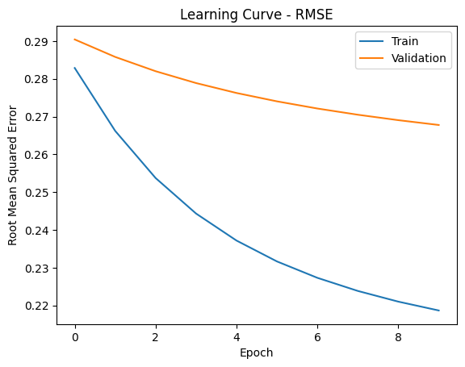  

**Insight:**
* Grafik menunjukkan penurunan konsisten pada nilai RMSE baik untuk data latih maupun validasi, menandakan bahwa model terus belajar dan meningkatkan akurasi prediksinya seiring bertambahnya epoch.

* Garis tren pada data validasi tetap lebih tinggi dari data latih, tetapi keduanya menurun paralel, menunjukkan bahwa model tidak overfitting secara ekstrem.

* Perbedaan nilai RMSE yang tidak terlalu jauh antara data pelatihan 0.218 dan validasi 0.268 mengindikasikan bahwa model memiliki kemampuan generalisasi yang cukup baik.

## Conclusion

**Kesimpulan:**
* Model Content-Based Filtering berhasil memberikan rekomendasi film yang relevan berdasarkan kemiripan konten (judul, genre, dan sinopsis) dengan pendekatan TF-IDF dan cosine similarity. Dari hasil evaluasi dengan precision sebesar 0.30, sistem mampu menghasilkan beberapa rekomendasi yang memiliki kesamaan konteks atau tema dengan film yang dicari, seperti "Toys in the Attic".

* Model Collaborative Filtering memanfaatkan interaksi pengguna berupa rating untuk menemukan pola preferensi dan memberikan saran film lain yang disukai pengguna serupa. Model ini mampu menghasilkan rekomendasi yang bervariasi dan personal. Berdasarkan evaluasi menggunakan Root Mean Squared Error (RMSE), model memperoleh nilai:

  * RMSE (Training): 0.218

  * RMSE (Validation): 0.268

Ini menunjukkan performa prediksi yang cukup baik, meskipun terdapat sedikit gap antara training dan validation.

**Saran Pengembangan:**
* Precision pada Content-Based Filtering dapat ditingkatkan dengan menambahkan fitur lain seperti aktor, sutradara, atau production company ke dalam representasi konten.

* Untuk Collaborative Filtering, dapat dikembangkan dengan pendekatan matrix factorization atau hybrid model agar bisa menangani cold-start problem dan memperkuat akurasi.

* Perlu penyesuaian threshold similarity atau pengayaan metadata film untuk menghasilkan rekomendasi yang lebih personal dan kontekstual.
